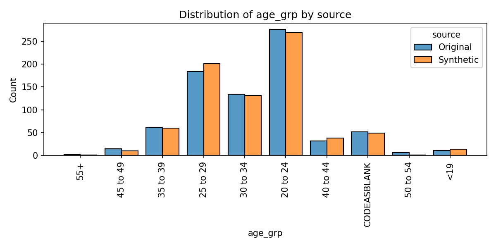
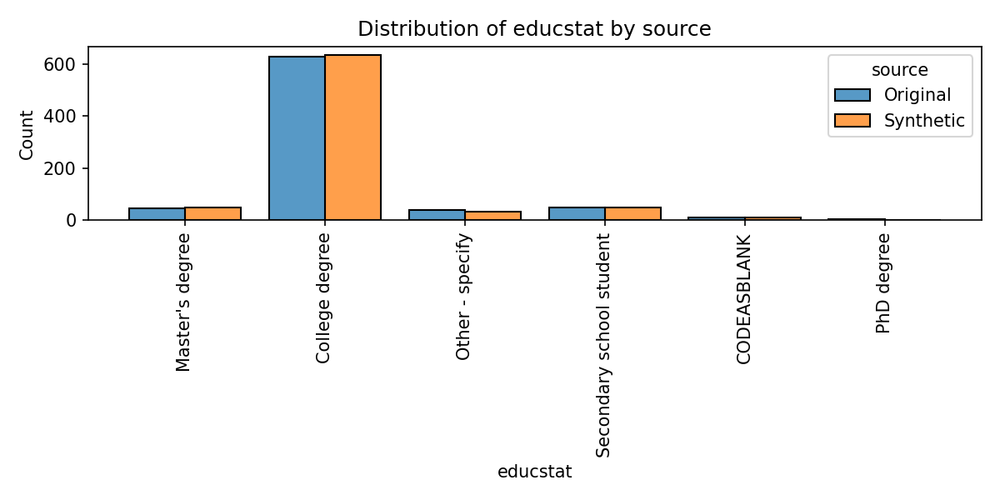
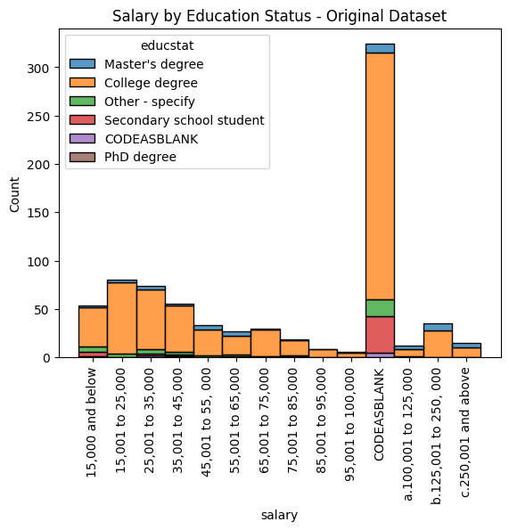
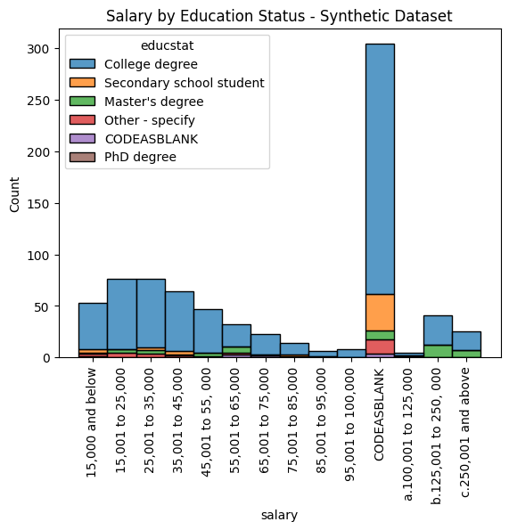
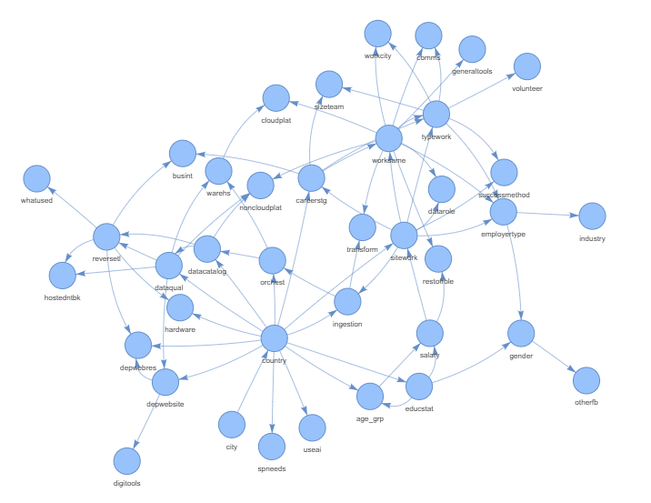

# Synthetic-Dataset-Generation-from-Surveys-Using-Python-Bayesian-Network
Synthetic dataset generation from survey data using python's pgmpy package and Bayesian models

## Why This Project Exists:  
Turn sensitive survey responses into **privacy‑safe synthetic datasets** while keeping the statistical patterns intact.  
The goal: allow analysis, sharing, and portfolio demonstration **without exposing any respondent’s real data**.

---

## What This Creates and Whom This is For:  
- Synthetic dataset outputs for public analysis without privacy risk.
- Part of my current workflow as survey leader of the Data Engineering Pilipinas group.
  
---

## Findings  
- Comparable distributions per column: based on **Side‑by‑side frequency distribution plots** for every column, comparing original vs synthetic data.
- **Click here** to see all the plots. Distribution of Original vs. Synthetic Datasets.pdf
  <b>
- 
- 

- **Salary vs. education stacked bar plots** indicate matching splits.
- The random entries for a few specific ranges in Salary will be deleted among Career Stage == Students and Educational Status == Secondary education.
- Note that original dataset also contains Salary entries for Students(Education) or Students/Career Break(Career Stage).
- 
- )
---

## Background  
- Raw survey data often contains **personally identifiable or sensitive information** (e.g., salary).  
- Taking out email information may not be sufficient to protect privacy.  
- This workflow uses a **Bayesian network approach** (`pgmpy` in Python) to model relationships between variables, then generates CPD then generates synthetic records that mimic the original dataset’s structure and distributions.  As an added step, if rows from synthetic dataset match the rows from the original dataset, they will be dropped.  Fortunately, all iterations produced clean unduplicated sets.
- You can read more about python's `pgmpy` here: [pgmpy documentation](https://pgmpy.org/)

---

## Workflow: 

- [Click here to see workflow](flowchart_pgmpy.txt)
  <b>
1. **Load & Preprocess**  
   - Read raw survey CSV, already cleaned of identifiers.  
   - Create an `age_grp` factor from numeric age.  
   - Remove non‑modeling columns.  
   - Normalize text encoding and replace blanks with `"CODEASBLANK"`.  
   - Convert all variables to factors for modeling consistency.

2. **Learn Model** 
   - Set seed edges from Naive Bayes model using educstart as target. (This gets replaced after iterations.)
   - Set Expert Knowledge edge city -> country and age_grp -> salary. 
   - Set ess ranges for priors.
   - Loop using ess ranges in bayesian network structure via **HillClimbSearch**. 
   - Extract and audit for isolated nodes for each loop.  Replace ess ranges if isolated nodes still present.
   - Below is the resulting network.  
   - Fit conditional probability tables using Bayesian Estimator.  (MLE as fallback in case distribution check fails.)
   
3. **Synthesize Dataset**
   - Set target duplicates = 20.  Set max runs = 5. Start loop.  
   - Generate synthetic datasets with the same number of rows as the original dataset.
   - Check if duplicate count is = 20. If > 20, loop back to generation step. Stop if met.
   - If duplicate count = 20, save seed, and save synthetic dataset. No duplicates seen for all 5 runs.

4. **Check for Privacy**  
   - Tag datasets as `real` or `synthetic`.  
   - Combine and check for **exact record matches** across all factor combinations.
   - Export duplication check containing synthetic rows for deletion in a csv file.
   - Fortunately, no duplicates appeared. But below shows the code if duplicates did appear.
		- **Drop row_ids of synthetic dataset** identified as similar to original dataset.
		- Export both original df and cleaned synthetic df for frequency distribution plots.

5. **Frequency Distributions**  
   - Compute per‑variable counts and proportions for both real and synthetic datasets.  
   - Combine into a single table for plotting.
   - Export combined long table of frequencies as csv.

6. **Visualization & Export**  
   - Loop through all variables, generating **side‑by‑side bar plots** (Original vs Synthetic).  
   - Save plots as PNGs and embed in an **HTML report** for easy review. 
   - Quick sanity checks: Salary by Education Status.
   

---
Sandy G. Cabanes
September 9, 2025
